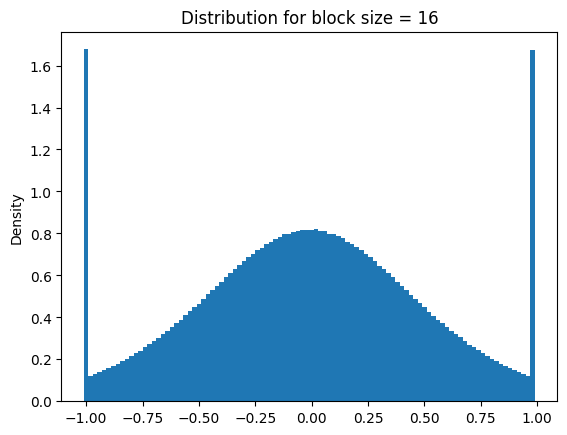
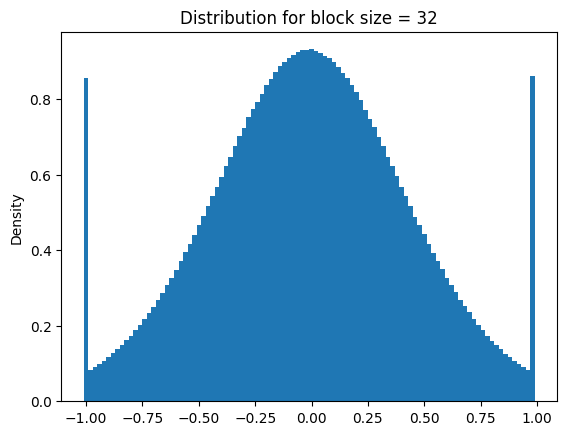
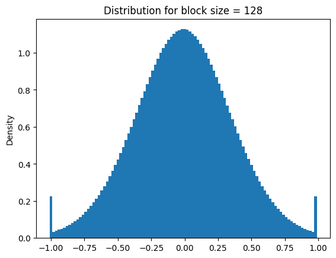
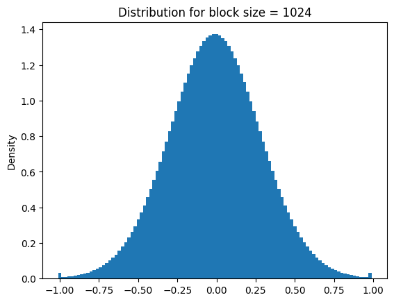
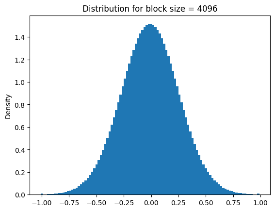
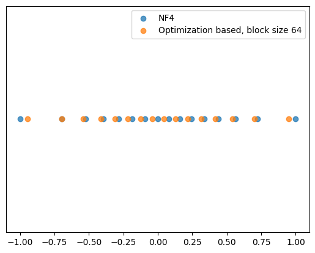
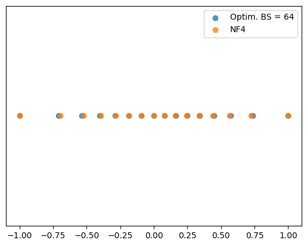
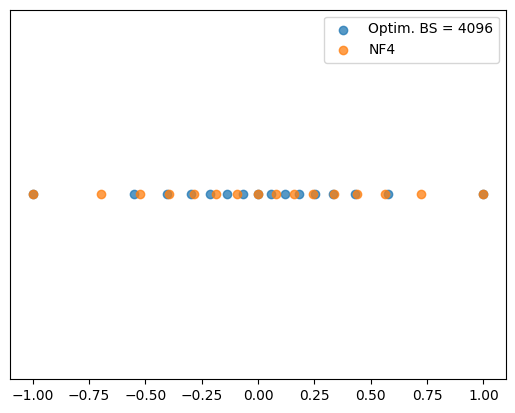

# NF4 isn't theoretically optimal!

The [QLora Paper](https://arxiv.org/abs/2305.14314) was just released, and it has a bunch of really impressive empirical work and tool releases. If you haven't checked it out yet, you should do that before reading this.

I have one minor gripe about the paper, which is that they repeatedly (this phrase appears 6 times in the paper) describe the new NF4 data type as:

> an information theoretically optimal quantization data type

The reasoning for this goes approximately as follows:

1. Coding theory-wise, we should assign an equal amount of probability-mass to each code value
2. The way to split a probability distribution with CDF $F$ into $n$ bins is to to put the splits at the points such that $F(x_i) = i/n$
3. Neural network weights are approximately normally distributed, so just do that with the normal distribution

So based on this with a slight tweak, the 16 NF4 values [are computed as follows](https://github.com/TimDettmers/bitsandbytes/blob/0f40fa3f0a198802056e29ba183eaabc6751d565/bitsandbytes/functional.py#L236):

1. Make 0 one of the code points
2. Add 8 points evenly spaced between CDF values of `0.5` and `0.9677083` (excluding the left endpoint since 0 is already included)
3. Add 7 points evenly spaced between CDF values of `1 - 0.9677083` and `0.5` (exclude the right endpoint)
4. Scale the code down by its maximum so that it lives in $[-1, 1]$, since when we quantize actual weights we'll be scaling them down by their absolute value

This results in the following values:

```python
NF4 = np.asarray([-1.0, -0.6961928009986877, -0.5250730514526367, -0.39491748809814453, -0.28444138169288635, -0.18477343022823334, -0.09105003625154495, 0.0, 0.07958029955625534, 0.16093020141124725, 0.24611230194568634, 0.33791524171829224, 0.44070982933044434, 0.5626170039176941, 0.7229568362236023, 1.0])
```

### The problem
So what's wrong with the argument above? The issue is that while neural network weights are approximately normally distributed, _neural network weights downscaled to have a maximum absolute value of 1 definitely aren't_.

Since this is the crux of the issue, let me remind you that the "block size" parameter controls how big the groups of parameters that get quantized together are. For each such group you calculate the maximum absolute value, then scale the whole group down by that amount, leading to a set of numbers in $[-1, 1]$ which you can then quantize by just assigning them to the nearest code value.

To see that this process doesn't give you a fixed normal distribution, you can just look at how those values end up for a variety of block sizes:

```python
batch_size = 2 ** 12
bins = 100
@partial(jax.jit, static_argnums=1)
def draw_sample(key, block_size):
    sample = jax.random.normal(key, (batch_size, block_size))
    # Downscale in the way we would if we were quantizing
    sample /= jnp.max(jnp.abs(sample), axis=-1, keepdims=True)
    hist, edges = jnp.histogram(sample, bins=bins, density=True)
    return hist, edges

def plot_block_size(block_size):
    plt.figure()
    total = jnp.zeros(bins)
    key = jax.random.PRNGKey(block_size)
    for _ in range(128):
        update, edges = draw_sample(key, block_size)
        total += update
        key, = jax.random.split(key, 1)
    
    total /= 128
    plt.title(f'Distribution for block size = {block_size}')      
    plt.ylabel('Density')      
    plt.bar(edges[:-1], total, width=edges[1] - edges[0])      
    plt.show()
```


```python
for block_size in (16, 32, 128, 1024, 4096):
    plot_block_size(block_size)
```


    

    


    

    


    

    


    

    


    

    


The distribution clearly varies with block size, so it can't be the case that NF4 is simultaneously optimal for all of them! The weird spikes on the ends aren't artifacts, they're due to the fact that it's guaranteed that at least one sample will take the value -1 or 1 after scaling. I was curious whether this converged to some well-known distribution, so I [asked](https://stats.stackexchange.com/questions/616752/does-the-following-distribution-converge-to-anything/616846#616846) stats.SE. It turns out that it just slowly converges to a point mass on 0, meaning that at very large block sizes the outer code values will be mostly unused.

Due to this, the NF4 code can't be optimal for this setting, since for large enough block sizes almost all the values will get mapped to 0! What went wrong in their reasoning? I think the issue is that their analysis is correct if you have a fixed scale factor, but not if it's data dependent, leading to a worse and worse relationship to the typical spread of your values as you increase the block size.

## Searching for block-size dependent codes
Prior to the QLora release, I was trying to guess what the NF4 type might be based on random tidbits. Since I'm an ML researcher in 2023, I just tried to minimize the squared quantization error with Adam. That worked okay, but not amazingly. Switching to minimizing absolute error instead gave me much better results:


```python
batch_size = 2 ** 12
optimizer = optax.adam(learning_rate=1e-3)
def loss_fn(code, sample):
    shortest_distances = jnp.min(jnp.abs(sample[:, :, None] - code), axis=-1)
    return jnp.mean(shortest_distances)

def update(code, opt_state, key, block_size, loss_fn=None):
    sample = jax.random.normal(key, (batch_size, block_size))
    sample /= jnp.max(jnp.abs(sample), axis=-1, keepdims=True)
    
    loss, grad = jax.value_and_grad(loss_fn)(code, sample)
    
    updates, opt_state = optimizer.update(grad, opt_state)
    new_code = optax.apply_updates(code, updates)
    
    return new_code, opt_state, loss


def optimization_based_code(block_size, loss_fn=loss_fn):
    key = jax.random.PRNGKey(0)

    code = jnp.linspace(-1, 1, 16)
    
    # Make sure 0 is in the code initially, this will be relevant later
    code = code.at[7].set(0)
    
    optimizer = optax.adam(learning_rate=1e-3)
    opt_state = optimizer.init(code)

    update_fn = jax.jit(partial(update, block_size=block_size, loss_fn=loss_fn))
    
    for step in range(1, 5001):
        key, = jax.random.split(key, 1)
        code, opt_state, loss = update_fn(code, opt_state, key)
        if step % 1000 == 0:
            print(f'Step {step} loss: {loss:.3e}')
    return code
```

Now let's see how this code compares to the NF4 one.


```python
bs64_optimized_code = optimization_based_code(64)

def compare_codes(codes):
    fig, ax = plt.subplots()
    ax.get_yaxis().set_visible(False)
    for label, code in codes.items():
        ax.scatter(code, np.zeros_like(code), label=label, alpha=0.75)
    plt.legend()
    fig.show()

compare_codes({'NF4': NF4, 'Optimization based, block size 64': bs64_optimized_code})
```

    Step 1000 loss: 2.816e-02
    Step 2000 loss: 2.814e-02
    Step 3000 loss: 2.806e-02
    Step 4000 loss: 2.815e-02
    Step 5000 loss: 2.818e-02


    

    


The above plot shows the values that each code can represent.

As you can see they look pretty similar, with the main difference being that NF4 requires that -1, 1 and 0 be in the code. In my brief experiments, not "pinning" those three values into the code was deterimental. One possible explanation is that it's guaranteed that at least one value will be -1 and 1 in each bloc. Even more confusingly I found that requiring -1.05 and 1.05 to be in the code _also_ worked (slightly better even), despite the fact that those values can't occur in the downscaled parameters.

At any rate, it's easy to replace the loss function to prevent those three values from getting modified:

```python
def pinned_loss_fn(code, sample):
    code = code.at[0].set(-1)
    code = code.at[7].set(0)
    code = code.at[-1].set(1)
    return loss_fn(code, sample)
```


```python
optimized_codes = {}
for block_size in (64, 128, 1024, 4096):
    print(f'Optimizing code for block size: {block_size}')
    code = optimization_based_code(block_size, loss_fn=pinned_loss_fn)
    optimized_codes[block_size] = code
    assert code[0] == -1.
    assert code[7] == 0.
    assert code[-1] == 1.
```

    Optimizing code for block size: 64
    Step 1000 loss: 2.832e-02
    Step 2000 loss: 2.838e-02
    Step 3000 loss: 2.835e-02
    Step 4000 loss: 2.838e-02
    Step 5000 loss: 2.843e-02
    Optimizing code for block size: 128
    Step 1000 loss: 2.727e-02
    Step 2000 loss: 2.731e-02
    Step 3000 loss: 2.742e-02
    Step 4000 loss: 2.733e-02
    Step 5000 loss: 2.730e-02
    Optimizing code for block size: 1024
    Step 1000 loss: 2.412e-02
    Step 2000 loss: 2.407e-02
    Step 3000 loss: 2.407e-02
    Step 4000 loss: 2.406e-02
    Step 5000 loss: 2.405e-02
    Optimizing code for block size: 4096
    Step 1000 loss: 2.213e-02
    Step 2000 loss: 2.214e-02
    Step 3000 loss: 2.216e-02
    Step 4000 loss: 2.213e-02
    Step 5000 loss: 2.214e-02

It's probably smarter to get these codes by estimating the quantiles of the "scaled down normal" distribution rather than using Adam but this is what I happened to implement and I'm just rushing this notebook out so I can move on to doing other stuff.

### NF4 seems to be pretty good for small block sizes
Comparing the codes optimized for block sizes of 64, we can see that NF4 is pretty similar to the block size 64 one, but as expected is very different from the optimum for block size 4096:


```python
compare_codes({'Optim. BS = 64': optimized_codes[64], 'NF4': NF4})
compare_codes({'Optim. BS = 4096': optimized_codes[4096], 'NF4': NF4})
```


    

    


    

    


## Testing the codes
Since what we actually care about is how well these work for quantizing actual neural networks, I ran some comparisons between using NF4 and these block-size specific codes to quantize models and see how much their output changes. If you don't care about the implementation just scroll down to the bottom for a summary.


```python
quantize_param_to_code = jax.jit(quantize_param_to_code, static_argnames=('block_size',))
```


```python
@jax.jit
def kl_div(p_logits, q_logits, mask):
    p_lps = jax.nn.log_softmax(p_logits, axis=-1)
    q_lps = jax.nn.log_softmax(q_logits, axis=-1)
    p = jnp.exp(p_lps)
    total = jnp.sum(p * (p_lps - q_lps) * mask[:, :, None])
    n_tok = jnp.sum(mask)
    return total / n_tok
```


```python
def quantizer(code, block_size, param):
    if len(param.shape) < 2:
        return param
    if any(dim > 20000 for dim in param.shape):
        # Don't quantize embeddings/LM heads
        return param
    return quantize_param_to_code(code, param, block_size=block_size)
```


```python
def prepare_inputs(tokenizer, sents):
    tokenizer.pad_token = tokenizer.eos_token

    output = tokenizer(sents, return_tensors='np', padding=True)
    return jnp.asarray(output.input_ids), jnp.asarray(output.attention_mask)
```


```python
def compare_kl(model, params, block_size, inputs, masks):
    # Get the original model predictions
    orig_logits = jax.jit(model)(inputs, params=params).logits
    
    # Wrap the model code in a transformation which will dequantize parameters before use
    quantized_model = jax.jit(use_quantized(model))
    
    
    codes = {
        'NF4': NF4,
        'optimized': optimized_codes[block_size],
        'uniform': jnp.linspace(-1., 1., 16)
    }
    
    print(f'Model: {model_name}')
    print(f'Block size: {block_size}')
    kls = {}
    for name, code in codes.items():
        # quantize the model parameters and get the predictions
        code_quantizer = partial(quantizer, code, block_size)
        quant_params = jax.tree_map(code_quantizer, params)
        quant_logits = quantized_model(inputs, params=quant_params).logits
        del quant_params
        
        kl = kl_div(orig_logits, quant_logits, masks).item()
        print(f'{name} KL-div from original: {kl:.4e}')

    # Use the block size optimized code to get preidctions
    opt_quantizer = partial(quantizer, optimized_codes[block_size], block_size)
    opt_code_params = jax.tree_map(opt_quantizer, params)
    opt_code_logits = quantized_model(inputs, params=opt_code_params).logits
```


```python
test_sentences = [
    'The biggest lesson that can be read from 70 years of AI research is that general methods that leverage computation are ultimately the most effective, and by a large margin.',
    'GPT-3 achieves strong performance on many NLP datasets, including translation, question-answering, and cloze tasks, as well as several tasks that require on-the-fly reasoning or domain adaptation, such as unscrambling words, using a novel word in a sentence, or performing 3-digit arithmetic.',
    'But with modern logistics, you can get horse food basically anywhere. There’s no limit to how far the next steppe confederation could get. That’s why I think this is a true existential risk, not just another 5 - 10% of the world’s population like usual.',
    'We present QLoRA, an efficient finetuning approach that reduces memory usage enough to finetune a 65B parameter model on a single 48GB GPU while preserving full 16-bit finetuning task performance.'
]
```


```python
gpu = jax.devices('gpu')[0]
for model_name in (
    'gpt2-large',
    'EleutherAI/gpt-neo-2.7B',
):
    # Load model/tokenizer from HuggingFace and tokenize test examples
    tokenizer = AutoTokenizer.from_pretrained(model_name)
    model, params = FlaxAutoModelForCausalLM.from_pretrained(model_name, _do_init=False)
    params = jax.tree_map(lambda x: x.astype(jnp.float16) if x.dtype == jnp.float32 else x, params)
    params = jax.device_put(params, gpu)
                                                  
    inputs, masks = prepare_inputs(tokenizer, test_sentences)
    inputs = jax.device_put(inputs, gpu)

    for block_size in optimized_codes:
        compare_kl(model, params, block_size, inputs, masks)
        print()
```

    Model: gpt2-large
    Block size: 64
    NF4 KL-div from original: 2.8737e-02
    optimized KL-div from original: 2.9584e-02
    uniform KL-div from original: 9.1649e-02
    
    Model: gpt2-large
    Block size: 128
    NF4 KL-div from original: 4.4782e-02
    optimized KL-div from original: 4.1085e-02
    uniform KL-div from original: 1.3581e-01
    
    Model: gpt2-large
    Block size: 1024
    NF4 KL-div from original: 1.1242e-01
    optimized KL-div from original: 9.7351e-02
    uniform KL-div from original: 6.8215e-01
    
    Model: gpt2-large
    Block size: 4096
    NF4 KL-div from original: 2.0000e-01
    optimized KL-div from original: 1.3986e-01
    uniform KL-div from original: 1.6048e+00
    
    Model: EleutherAI/gpt-neo-2.7B
    Block size: 64
    NF4 KL-div from original: 9.7968e-02
    optimized KL-div from original: 9.5385e-02
    uniform KL-div from original: 2.8743e+00
    
    Model: EleutherAI/gpt-neo-2.7B
    Block size: 128
    NF4 KL-div from original: 1.0853e-01
    optimized KL-div from original: 1.0505e-01
    uniform KL-div from original: 3.3493e+00
    
    Model: EleutherAI/gpt-neo-2.7B
    Block size: 1024
    NF4 KL-div from original: 1.6415e-01
    optimized KL-div from original: 1.2324e-01
    uniform KL-div from original: 4.1480e+00
    
    Model: EleutherAI/gpt-neo-2.7B
    Block size: 4096
    NF4 KL-div from original: 2.2583e-01
    optimized KL-div from original: 1.6809e-01
    uniform KL-div from original: 4.7079e+00
    


### Results
The above results show the KL-divergence between quantized and un-quantized model predictions on a few test examples (smaller means there was less degradation). 

So it looks like using the block size specific codes generally helps, with gpt-2-large/block size 64 being the only setting where there wasn't an improvement. This makes sense since the NF4 code is pretty similar to the optimized codes for small block sizes. Accordingly, it looks like the benefits to using a block size specific code grows with block size.

They're both way better than using a uniform code though, and in terms of practical use there won't be much noticeable difference if you're using NF4 at the small default block sizes.
